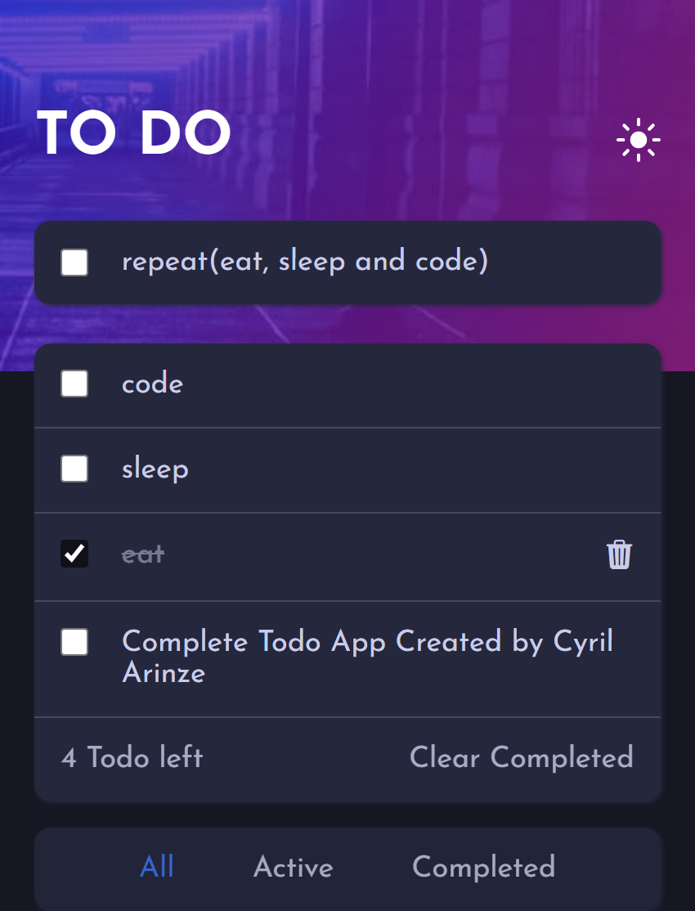

# Frontend Mentor - Todo app solution

This is a solution to the [Todo app challenge on Frontend Mentor](https://www.frontendmentor.io/challenges/todo-app-Su1_KokOW). Frontend Mentor challenges help you improve your coding skills by building realistic projects.

## Table of contents

- [Overview](#overview)
  - [The challenge](#the-challenge)
  - [Screenshot](#screenshot)
  - [Links](#links)
- [My process](#my-process)

  - [Built with](#built-with)

- [Author](#author)

## Overview

### The challenge

Users should be able to:

- View the optimal layout for the app depending on their device's screen size
- See hover states for all interactive elements on the page
- Add new todos to the list
- Mark todos as complete
- Delete todos from the list
- Filter by all/active/complete todos
- Clear all completed todos
- Toggle light and dark mode
- **Bonus**: Drag and drop to reorder items on the list

### Screenshot

.png>)
.png>)
.png>)

### Links

- Solution URL: [Solution](https://github.com/Cyril-Arinze/todo-app-main)
- Live Site URL: [Live site](https://cyril-arinze.github.io/todo-app-main/)

## My process

### Built with

- Semantic HTML5 markup
- CSS custom properties
- Flexbox
- Mobile-first workflow

## Author

- Website - [cyril Arinze](https://facebook.com/Cyrilarinze1)
- Frontend Mentor - [@Cyril-Arinze](https://www.frontendmentor.io/profile/Cyril-Arinze)
- Twitter - [@CyrilArinze3](https://twitter.com/CyrilArinze3)

